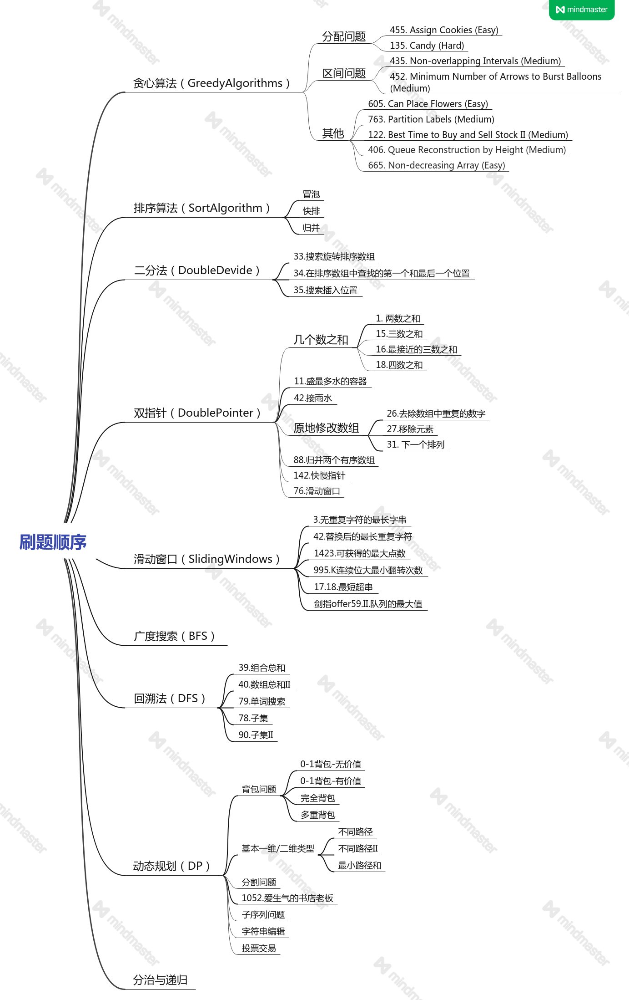

# leetcode算法岗刷题笔记
**以下是我总结的刷题顺序，此顺序参考多分资料，并结合算法岗特点，强化了贪心算法、动态规划等题内容，
重在算法岗经常考察的一些独特专题及典型题，如贪心算法、二分法、动态规划等**

## 使用方法
此图为总的刷题顺序，会随着个人刷题，持续更新下面的相关题目，欢迎小伙伴们一起来互相监督打卡  

  

本项目按专题分文件夹，每个专题文件夹分为problem、solution文件夹,专题总结markdown文档，其中
1. problem为leetcode问题定义+python最优最易理解的解决代码
2. solution为一些leetcode经典参考易理解的解析思路
3. 专题中的markdown文档，会将一个专题内的题目的套路，进行对比汇总，然后总结成专题模板  
（建议刷完以下所有题目后，熟悉题目后，再来看专题总结，效果更佳。）
